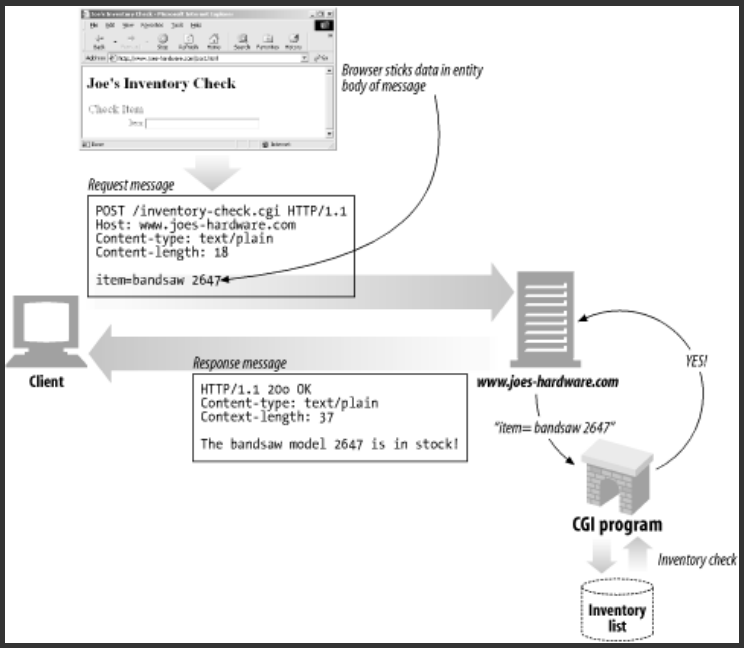
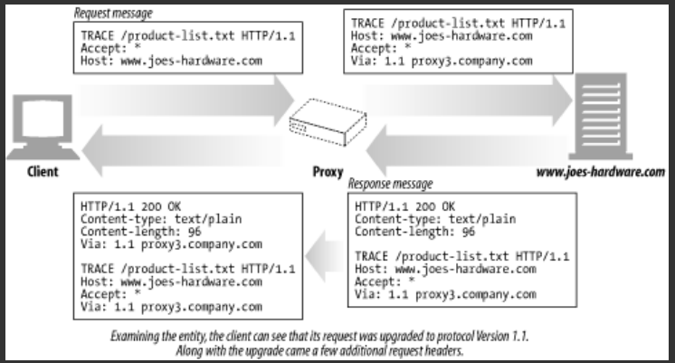
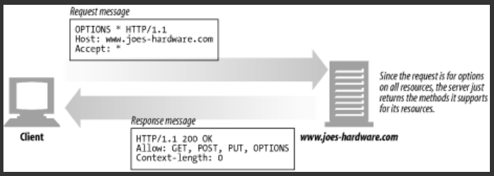
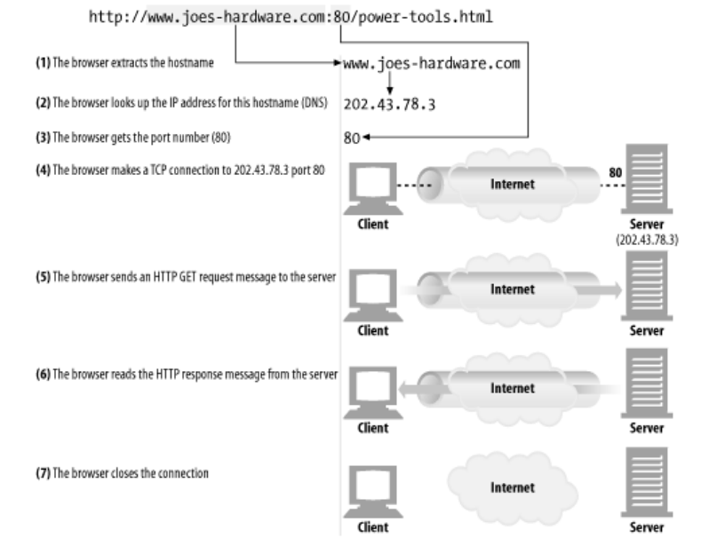
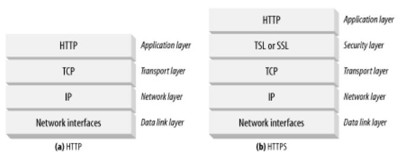
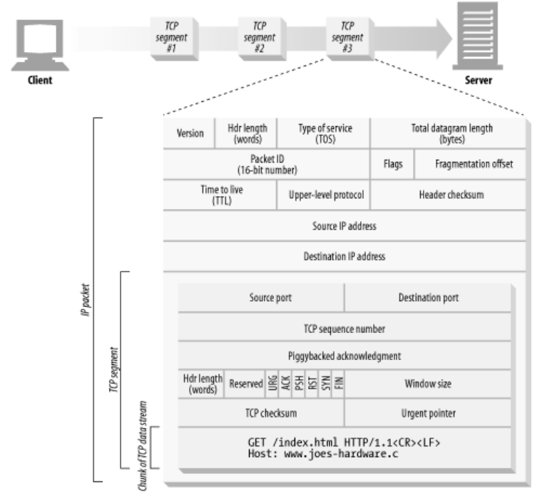

#Chapter 1:Overview of HTTP

##Media Types
What's MIME?
> Multipurpose Internet Extensions  
> It's a textual label,represented as a primary object type and a specific subtype,separated by splash:`text/html`  

##URIs
URI is *uniform resource identifier*.  
URIs come in two flavors,called URLs and URIs.  

###URLs
*uniform resource locator* is the most common form of resource identifier  
URLs follows a standard format of three main parts:  

1. The **scheme**,it describes the protocol used to access the resource.  
1. The server internet address.  
1. Names a resource on the web server.  

###URNs
URN is *uniform resource name*
> A URN serves as a unique name for a particular piece of content, independent of where the resource currently resides  
    urn:ietf:rfc:2141 is used to name the Internet standards document "RFC 2141"
> URNs are still experimental and not yet widely adopted.(13.10.25) 

##Methods
* GET
* POST
* PUT
* DELETE
* HEAD

##Status Codes
* 200-&gt;Ok  
* 302-&gt;Redirect  
* 404-&gt;Not found  

##**Messages**
* HTTP messages sent fromweb clients to web servers are called request messages.  
* Messages fromservers to clients are called response messages  

HTTP messages consist of three parts:

1. Start line

    The first line of the message is the start line, indicating what to do for a request or what happened for a response.   

1. Header fields

    Zero or more header fields follow the start line. Each header field consists of a name and a value, separated bya colon (:) for easy parsing. The headers end with a blank line. Adding a header field is as easy as addinganother line.     

1. Body

    After the blank line is an optional message body containing any kind of data. Request bodies carry data tothe web server; response bodies carry data back to the client. Unlike the start lines and headers, which aretextual and structured, the body can **contain arbitrary binary data** (e.g., images, videos, audio tracks, softwareapplications). Of course, the body can also contain text.     

##Tcp/Ip
Tcp is  Transmission Control Protocol  

Before an HTTP client can send a message to a server, it needs to establish a TCP/IP connection between the clientand server using Internet protocol (IP) addresses and port numbers. 

**Steps how a browser uses HTTP to display a simple HTML resource**  

1. The browser extracts the server's hostname fromthe URL.  
1. The browser converts the server's hostname into the server's IP address. -> DNS  
1. The browser extracts the port number (if any) fromthe URL.  
1. The browser establishes a TCP connection with the web server.  
1. The browser sends an HTTP request message to the server.  
1. The server sends an HTTP response back to the browser.  
1. The connection is closed, and the browser displays the document.  

##Architectural Components of the Web

###Proxies
> HTTP intermediaries that sit between clients and servers   

###Caches
> A web cacheor caching proxyis a special type of HTTP proxy server that keeps copies of popular documents that pass through the proxy   

###Gateways
> Gatewaysare special servers that act as intermediaries for other servers.  

###Tunnels
> Tunnelsare HTTP applications that, after setup, blindly relay raw data between two connections.  

###Agents
> User agents (or just agents) are client programs that make HTTP requests on the user's behalf.Any application that issues web requests is an HTTP agent

---------------

#URLs and Resources

##URL syntax
Most URL schemes base their URL syntaxon this nine-part general format: `<scheme>://<user>:<password>@<host>:<port>/<path>;<params>?<query>#<frag>`  

###Scheme
> Scheme names are case-insensitive

###Hosts and Ports

###Usernames and Passwords
For example, if you hand your browser an FTP URL without specifying a username and password, it will insert "anonymous" for your username and send a default password (Internet Explorer sends "IEUser", while Netscape Navigator sends "mozilla").
    
###Paths

###Parameters->= & ;
> This component is just a list of name/value pairs in the URL, separated fromthe rest of the URL (and from each other) by ";" characters  
> As we mentioned earlier, the path component for HTTP URLs can be broken into path segments. Each segment can have its own params. For example:  

    http://www.joes-hardware.com/hammers;sale=false/index.html;graphics=true  

> In this example there are two path segments, hammersand index.html. The hammerspath segment has the param sale, and its value is false. The index.htmlsegment has the param graphics, and its value is true.  

###Query Strings-&gt;?
> The *right of the question mark (?)* is called the querycomponent  
> There is no requirement for the format of the query component, except that some characters are illegal, as we'll see later in this chapter. By convention, many gateways expect the query string to be formatted as a series of "name=value" pairs, separated by "&" characters.  

###Fragments-&gt;#
> To allow referencing of parts or fragments of a resource, URLs support a fragcomponent to identify pieces within a resource
> A fragment dangles off the right-hand side of a URL, preceded by a #character. For example: `http://www.joes-hardware.com/tools.html#drills`

> Because HTTP servers generally deal only with entire objects, not with fragments of objects, clients **don't pass fragments along to servers**. After your browser gets the entireresource fromthe server, it then uses the fragment to display the part of the resource in which you are interested.

##Relative URLs

###Base URLs
* Explicitly provided in the resource

    Some resources explicitly specify the base URL. An HTML document, for example, may include a <BASE> HTML tag defining the base URL by which to convert all relative URLs in that HTML document.   

* Base URL of the encapsulating resource

    If a relative URL is found in a resource that does not explicitly specify a base URL, it can use the URL of the resource in which it is embedded as a base.  

* No base URL

    In some instances, there is no base URL. This often means that you have an absolute URL; however, sometimes you may just have an incomplete or broken URL.  

###Resolving relative references

##Shady Characters
> URLs are permitted to contain only characters froma relatively small, universally safe alphabet.  
> This is caused by the use of a 7-bit encoding for messages; this can strip off information if the source is encoded in 8 bits or more  

> To complicate matters further, URLs also need to be complete. URL designers realized there would be times when people would want URLs to contain binary data or characters outside of the universally safe alphabet. So, **an escape mechanism** was added, allowing unsafe characters to be encoded into safe characters for transport.  

###The URL Character Set
> Recognizing the need for completeness, the URL designers have incorporated escape sequences. *Escape sequences allow the encoding of arbitrary character values or data using a restricted subset of the US-ASCII character set, yielding portability and completeness.*  

###Encoding Mechanisms
> The encoding simply represents the unsafe character by **an "escape" notation**, consisting of **a percent sign (%)** followed by **two hexadecimal digits** that represent the ASCII code of the character

###Character Restrictions
* `$ , +`

    Reserved

* `@ & =`

    Reserved because they have special meaning in the context of some schemes  

* `{ } | \ ^ ~ [ ] \``

    Restricted because of unsafe handling by various transport agents, such as gateways  

* `< > "`

    Unsafe; should be encoded because these characters often have meaning outside the scope of the URL, such as delimiting the URL itself in a document (e.g., "http://www.joes-hardware.com")  

* `0x00-0x1F,0x7F`

    Restricted; characters within these hexranges fall within the nonprintable section of the US-ASCII character set  

* `> 0x7F`

    Restricted; characters whose hexvalues fall within this range do not fall within the 7-bit range of the US-ASCII character set  

###A Bit More
> Applications need to walk a fine line. It is best for client applications to convert any unsafe or restricted charactersbefore sending any URL to any other application.[6]Once all the unsafe characters have been encoded, the URL is in acanonical form that can be shared between applications; there is no need to worry about the other application gettingconfused by any of the characters' special meanings.  

##A Sea of Schemes
1. http

    `http://<host>:<port>/<path>?<query>#<frag>`  

1. https

    The only difference between http and https is that the https scheme uses Netscape'sSecure Sockets Layer (SSL), which provides end-to-end encryption of HTTP connections    
    default port is 443.  

1. mailto

    `mailto:<RFC-822-addr-spec>`  

1. ftp

    `ftp://<user>:<password>@<host>:<port>/<path>;<params>`  

1. rtsp,rtspu

    RTSP URLs *are identifiers for audio and video media resources* that can be retrieved through the Real Time Streaming Protocol.  
    The "u" in the rtspu scheme denotes that the **UDP** protocol is used to retrieve the resource.  
    `rtsp://<user>:<password>@<host>:<port>/<path>`  
    `rtspu://<user>:<password>@<host>:<port>/<path>`  

1. file

    The file scheme denotes files directly accessible on a given host machine (by local disk, a networkfilesystem, or some other file-sharing system).  
    If the host is omitted, itdefaults to the local host fromwhich the URL is being used.  
    `file://<host>/<path>`  

1. news

    The news scheme is used to access specific articles or newsgroups, as defined by RFC 1036  
    `news:<newsgroup>` or `news:<news-article-id>`  

1. telnet

    The telnet scheme is used to access interactive services.  
    `telnet://<user>:<password>@<host>:<port>/`  

-------------------------------------

#HTTP Messages

##The Flow of Messages

###Messages Commute Inbound to the Origin Server

  

###Messages Flow Downstream

HTTP messages flow like rivers. All messages flow downstream, regardless of whether they are request messages or response messages.  
> The terms "upstream" and "downstream" relate only to the sender and receiver. We can't tell whether a message is heading to the origin server or the client, because both are downstream.  

  

##The Parts of a Message
1. **The start line and headers** are just ASCII text, broken up by lines.Each line ends with a two-character end-of-linesequence, consisting of a carriage return (ASCII 13) and a line-feed character (ASCII 10) .This end-of-line sequence is written "CRLF."  

    > It is worth pointing out that while the HTTP specification for terminating lines is CRLF, robust applications also should accept just a line-feed character.  

1. **the headers** give you a bit of information about the body. The Content-Type line tells you what the body is—in this example, it is a plain-text document. The Content-Length line tells you how big the body is; here it is a meager 19 bytes.  
1. **The entity body** or message body (or just plain "body") is simply an optional chunk of data  

###Message Syntax
1. The format for a request message:

    `<method> <request-URL> <version>
    <headers>
    <entity-body>
    `
1. The format for a response message:

    `<version> <status> <reason-phrase>
    <headers>
    <entity-body>
    `

Note that a set of HTTP headers should always *end in a blank line (bare CRLF)*, even if there are no headers and even if there is no entity body  

> Historically, however, many clients and servers (mistakenly) omitted the final CRLF if there was no entity body. To interoperate with these popular but noncompliant implementations, clients and servers **should accept messages that end without the final CRLF**.  

###Start Lines
The start line for a request message says what to do. The start line for a response message says what happened.  

####Request Line
1. method
1. request URL
1. HTTP version(not required prior to HTTP/1.0)

####Response Line
1. HTTP version
1. numeric status code
1. textual reason phrase

####Methods

####Status codes and Reason phrases
1. Status codes between 200 and 299 represent success.  
1. Codes between 300 and 399 indicate that the resource has been moved.  
1. Codes between 400 and 499 mean that the client did something wrong in the request.  
1. Codes between 500 and 599 mean something went awry on the server.  

####Version numbers
The version number indicates the highest version of HTTP that an application supports.  
> Note that version numbers are not treated as fractional numbers. Each number in the version (for example, the "1" and "0" in HTTP/1.0) is treated as a separate number

###Headers

####Header classifications
The HTTP specification defines several header fields. Applications also are free to invent their own home-brewed headers.  
HTTP headers are classified into:  

* General headers: Can appear in both request and response messages 
* Request headers: Provide more information about the request 
* Response headers: Provide more information about the response 
* Entity headers: Describe body size and contents, or the resource itself 
* Extension headers: New headers that are not defined in the specification 

Each HTTP header has a simple syntax: a name, followed by a colon (:), followed by optional whitespace, followed by the field value, followed by a CRLF

###Entity Bodies
HTTP messages can carry many kinds of digital data: images, video, HTML documents, software applications, credit card transactions, electronic mail, and so on.  

###Version 0.9 Messages
HTTP/0.9 messages also consisted of requests and responses, but the request contained merely **the methodand the request URL**, and the response contained only the **entity**.  

##Methods
To be compliant with HTTP Version 1.1, a server need implement only the GET and HEAD methods for its resources.  

###Safe Methods
HTTP defines a set of methods that are called safemethods. **The GET and HEAD methods** are said to be safe, meaning that no action should occur as a result of an HTTP request that uses either the GET or HEAD method. 

###GET
GET is the most common method. It usually is used to ask a server to send a resource. HTTP/1.1 requires servers to implement this method.  

###HEAD
The HEAD method behaves exactly like the GET method, but the server returns only the headers in the response  

1. Find out about a resource (e.g., determine its type) without getting it. 
1. See if an object exists, by looking at the status code of the response. 
1. Test if the resource has been modified, by looking at the headers. 

###PUT
The PUT method writes documents to a server, in the inverse of the way that GET reads documents froma server.  
The semantics of the PUT method are for the server to take the body of the request and either use it to create a new document named by the requested URL or, if that URL already exists, use the body to replace it.  

###POST

###TRACE
The TRACE method allows clients to see how its request looks when it finally makes it to the server.  
A TRACE request initiates a "loopback" diagnostic at the destination server. The server at the final leg of the trip bounces back a TRACE response, with the virgin request message it received in the body of its response.  

> TRACE does not provide a mechanismto distinguish methods  

No entity body can be sent with a TRACE request. The entity body of the TRACE response contains, verbatim, **the request that the responding server received**.  

###OPTIONS
The OPTIONS method asks the server to tell us about the various supported capabilities of the web server.  

  

###DELETE
asks the server to delete the resources specified by the request URL
However, the client application* is not guaranteed that the delete is carried out*. This is because the HTTP specification allows the server to override the request without telling the client

###Extension Methods
These methods are all part of the WebDAVHTTP extension (see Chapter 19) that helps support publishing of web content to web servers over HTTP  

1. LOCK: Allows a user to "lock" a resource—for example, you could lock a resource while you are editing it to prevent others fromediting it at the same time  
1. MKCOL: Allows a user to create a resource  
1. COPY: Facilitates copying resources on a server  
1. MOVE: Moves a resource on a server  

##Status Codes

###100-199: Informational Status Codes
1. 100 Continue
1. 101 Switching Protocols

####Clientsand 100 Continue
> If a client is sending an entity to a server and is willing to wait for a 100 Continue response before it sends the entity, the client needs to send an **Expect request header** with the value 100-continue.  

> 100-continue, in many ways, is an optimization. A client application should really use 100-continue only to avoid sending a server a large entity that the server will not be able to handle or use.  

####Serversand 100 Continue
> Servers should never send a 100 Continue status code to clients that do not send the 100-continue expectation  

> If for some reason the server receives some (or all) of the entity before it has had a chance to send a 100 Continue response, it does not need to send this status code, because the client already has decided to continue.  

####Proxies and 100 Continue
not very important.  

> A proxy that receives froma client a request that contains the 100-continue expectation needs to do a few things. If the proxy either knows that the next-hop server (discussed in Chapter 6) is HTTP/1.1-compliant or does not know what version the next-hop server is compliant with, it should forward the request with the Expect header in it. If it knows that the next-hop server is compliant with a version of HTTP earlier than 1.1, it should respond with the 417 Expectation Failed error. 

> If a proxy decides to include an Expect header and 100-continue value in its request on behalf of a client that is compliant with HTTP/1.0 or earlier, it should not forward the 100 Continue response (if it receives one fromthe server) to the client, because the client won't know what to make of it.

###200-299: Success Status Codes
* 200 OK
* 201 Created
* 202 Accepted
* 203 Non-Authoritativ Information
* 204 No Content
* 205 Reset Content
* 206 Partial Content

###300-399: Redirection Status Codes
* 300 Multiple Choices

    Returned when a client has requested a URL that actually refers to multiple resources, such as a server hosting an English and French version of an HTML document.  

* 301 Moved Permanently
* 302 Found
* 303 See Other

    Used to tell the client that the resource should be fetched using a different URL  

* 304 Not Modified
* 305 Use Proxy
* 306 Unused)
* 307 Temporary Redirect

> When an HTTP/1.0 client makes a POST request and receives a 302 redirect status code in response, it will follow the redirect URL in the Location header with a GET request to that URL.But the HTTP/1.1 specification uses the 303 status code to get this same behavior  
> To get around the confusion, the HTTP/1.1 specification says to use the 307 status code in place of the 302 status code for temporary redirects to HTTP/1.1 clients

###400-499: Client Error Status Codes
* 400 Bad Request
* 401 Unauthorized
* 402 Payment Required (is not used yet)
* 403 Forbidden
* 404 Not Found
* 405 Method Not Allowed
* 406 Not Acceptable

    Clients can specify parameters about what types of entities they are willing to accept. This code is used when the server has no resource matching the URL that is acceptable for the client.  

* 407 Proxy Authentication Required
* 408 Request Timeout
* 409 Conflict
* 410 Gone
* 411 Length Required
* 412 Precondition Failed
* 413 Request Entity Too Large
* 414 Request URI Too Long
* 415 Unsupported Media Type
* 416 Requested Range Not Satisfiable
* 417 Expectation Failed

###500-599: Server Error Status Codes
* 500 Internal Server Error
* 501 Not Implemented
* 502 Bad Gateway
* 503 Service Unavailable
* 504 Gateway Timeout
* 505 HTTP Version Not Supported

##Headers

###General Headers
* Connections: Allows clients and servers to specify options about the request/response connection 
* Dates: Provides a date and time stamp telling when the message was created
* MIME-Versions: Gives the version of MIME that the sender is using
* Trailers: Lists the set of headers that are in the trailer of a message encoded with the chunked transfer encoding 
* Transfer-Encodings: Tells the receiver what encoding was performed on the message in order for it to be transported safely 
* Upgrades: Gives a new version or protocol that the sender would like to "upgrade" to using 
* Vias: Shows what intermediaries (proxies, gateways) the message has gone through 

####General caching headers
* Cache-Control: Used to pass caching directions along with the message
* Pragma: Another way to pass directions along with the message, though not specific to caching 

###Request Headers
* Client-IP: Provides the IP address of the machine on which the client is running 
* From: Provides the email address of the client's user
* Host: Gives the hostname and port of the server to which the request is being sent 
* Referer: Provides the URL of the document that contains the current request URI
* UA-Color: Provides information about the color capabilities of the client machine's display 
* UA-CPU: Gives the type or manufacturer of the client's CPU
* UA-Disp: Provides information about the client's display (screen) capabilities 
* UA-OS: Gives the name and version of operating systemrunning on the client machine 
* UA-Pixels: Provides pixel information about the client machine's display 
* User-Agent: Tells the server the name of the application making the request

####Accept headers
* Accept: headers give the client a way to tell servers their preferences and capabilities  
* Accept: Tells the server what media types are okay to send
* Accept-Charset: Tells the server what charsets are okay to send
* Accept-Encoding: Tells the server what encodings are okay to send
* Accept-Language: Tells the server what languages are okay to send
* TE: Tells the server what extension transfer codings are okay to use

####Conditional request headers
* Expect: Allows a client to list server behaviors that it requires for a request 
* If-Match: Gets the document if the entity tag matches the current entity tag for the document
* If-Modified-Since: Restricts the request unless the resource has been modified since the specified date 
* If-None-Match: Gets the document if the entity tags supplied do not match those of the current document 
* If-Range: Allows a conditional request for a range of a document
* If-Unmodified-Since: Restricts the request unless the resource has notbeen modified since the specified date 
* Range: Requests a specific range of a resource, if the server supports range requests

####Request security headers
HTTP natively supports a simple challenge/response authentication scheme for requests. It attempts to make transactions slightly more secure by requiring clients to authenticate themselves before getting access to certain resources.  

Authorization: Contains the data the client is supplying to the server to authenticate itself 
Cookie: Used by clients to pass a token to the server—not a true security header, but it does have security implications
Cookie2: Used to note the version of cookies a requestor supports; see Section 11.6.7

####Proxy request headers
* Max-Forwards: The maximumnumber of times a request should be forwarded to another proxy or gateway on its way to the origin server—used with **the TRACE method**
* Proxy-Authorization: Same as Authorization, but used when authenticating with a proxy
* Proxy-Connection: Same as Connection, but used when establishing connections with a proxy 

###Response Headers
* Age: How old the response is
* Public: A list of request methods the server supports for its
* resources: Retry-After A date or time to try back, if a resource is unavailable
* Server: The name and version of the server's application software 
* Title: For HTML documents, the title as given by **the HTML document source**
* Warning: A more detailed warning message than what is in the reason phrase

####Negotiation headers
* Accept-Ranges: The type of ranges that a server will accept for this resource
* Vary: A list of other headers that the server looks at and that may cause the response to vary; i.e., a list of headers the server looks at to pick which is the best version of a resource to send the client  //So it means that the server send the negotiation headers before send the required resources?  

####Response security headers
* Proxy-Authenticate: A list of challenges for the client from the proxy
* Set-Cookie: Not a true security header, but it has security implications; used to set a token on the client side that the server can used to identify the client  //The server use this header to create cookie on the client.The grammar is similar with the cookie header  
* Set-Cookie2: Similar to Set-Cookie, RFC 2965 Cookie definition; see Section 11.6.7
* WWW-Authenticate: A list of challenges for the client from the server

###Entity Headers
> Because both request and response messages can contain entities, these headers can appear in either type of message.
* Allow: Lists the request methods that can be performed on this entity
* Location: Tells the client where the entity really is located; used in directing the receiver to a (possibly new) location (URL) for the resource 

####Content headers
* Content-Base: The base URL for resolving relative URLs within the body
* Content-Encoding: Any encoding that was performed on the body
* Content-Language: The natural language that is best used to understand the body
* Content-Length: The length or size of the body
* Content-Location: Where the resource actually is located
* Content-MD5: An MD5 checksum of the body
* Content-Range: The range of bytes that this entity represents fromthe entire resource 
* Content-Type: The type of object that this body is

####Entity caching headers
The general caching headers provide directives about how or when to cache. The entity caching headers provide information about the entity being cached  

* ETag: The entity tag associated with this entity
* Expires: The date and time at which this entity will no longer be valid and will need to be fetched fromthe original source 
* Last-Modified: The last date and time when this entity changed

------------------------------

#Connection Management

##TCP Connections
  

###TCP Reliable Data Pipes
TCP gives HTTP a reliable bit pipe.Bytes stuffed in one side of a TCP connection come out the other side correctly,and in the right order  

###TCP Streams Are Segmented and Shipped by IP Packets
TCP sends its data in little chunks called IP packets(or IP datagrams).  

  

When HTTP wants to transmit a message, it streams the contents of the message data, in order, through an open TCP connection. TCP takes the streamof data, chops up the data streaminto chunks called segments, and transports the segments across the Internet inside envelopes called IP packets  

Each TCP segment is carried by an IP packet fromone IP address to another IP address. Each of these IP packets contains: 

1. An IP packet header (usually 20 bytes)
1. A TCP segment header (usually 20 bytes)
1. A chunk of TCP data (0 or more bytes)

  

###Keeping TCP Connections Straight
A TCP connection is distinguished by four values: &lt;source\-IP\-address, source-port, destination-IP-address, destination-port>  

###Programming with TCP Sockets
The sockets API lets you create TCP endpoint data structures, connect these endpoints to remote server TCP endpoints, and read and write data streams  

